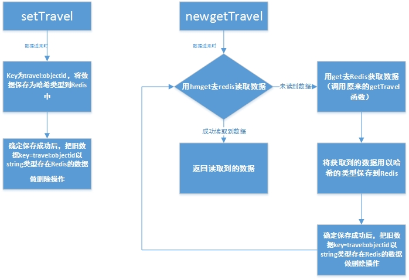
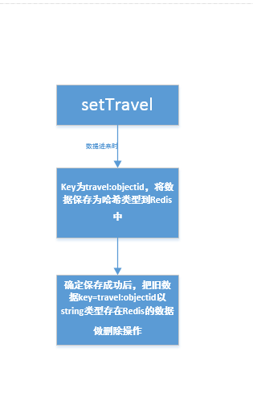
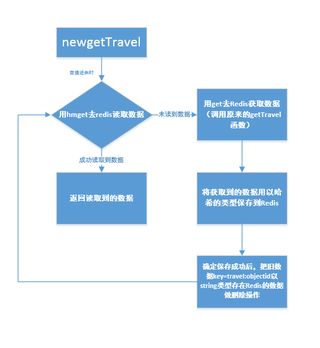

# 设计文档
## 背景
在CAP(c++)中的setTravel是将数据以json字符串类型的形式保存到Redis，然后在getTravel中取出这段字符串进行json解析，由于在解析json时导致CPU占用太高，故需要对此进行优化。
## 优化方法
1、在setTravel中对数据保存时，以哈希的类型保存到Redis中。

2、使用RepidJson库，进行json解析。(经过测试，解析效率提升不是太明显，因此不不使用该方法)。
## 整体设计

### setTravel

>在setTravel中有新数据请求时，使用哈希类型保存数据到Redis，在保存成功之后，对旧数据(string类型保存到Redis)进行删除的操作。
### newgetTravel

>由于可能存在有些数据还没有改成以哈希类型保存的情况，顾在在newgetTravel中，读取数据时需要进行判断，先用哈希的方式去读数据，倘若成功读取到数据，则表明该数据已经改成哈希类型保存到Redis里面了，若读不到数据，则表明这个数据可能还是以string类型保存在Redis里面的，这时就换成string方式去读数据，若还是没有数据就返回错误，若成功读到数据了，就用哈希的方式将数据进行保存到Redis中。保存成功之后，用哈希的方式去读取数据，返回结果，同时对旧数据进行删除操作。

## 注意事项
1、由于在CAP(c++)中,存在多处对于这两个函数的调用，因此需要注意此处的处理。

2、写完程序需要进行测试。
